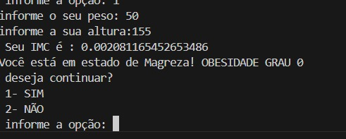

# IMC.PYTHON
## SOBRE

O projeto **IMC.PYTHON** foi desenvolvido em Python com o objetivo de calcular o Índice de Massa Corporal (IMC) de uma pessoa de forma simples e rápida. O sistema solicita ao usuário informações como peso e altura, realiza automaticamente o cálculo do IMC e informa a classificação correspondente de acordo com a tabela de obesidade.

⚖️Além de calcular o resultado, o programa também identifica a condição física do usuário, mostrando se ele está em estado de magreza, peso normal, sobrepeso ou obesidade em diferentes graus.

👁️ O projeto foi criado com foco em praticar conceitos básicos da programação em Python, como:

* Entrada e saída de dados
* Estruturas de repetição (`while`)
* Estruturas condicionais (`if`, `elif`, `else`)
* Operações matemáticas
* Conversão de tipos de dados

💡 Esse projeto contribui para o aprendizado lógico e para o desenvolvimento de aplicações simples voltadas à interação com o usuário no terminal.
Além de calcular o resultado, o programa também identifica a condição física do usuário, mostrando se ele está em estado de magreza, peso normal, sobrepeso ou obesidade em diferentes graus.

Esse projeto contribui para o aprendizado lógico e para o desenvolvimento de aplicações simples voltadas à interação com o usuário no terminal.

 
